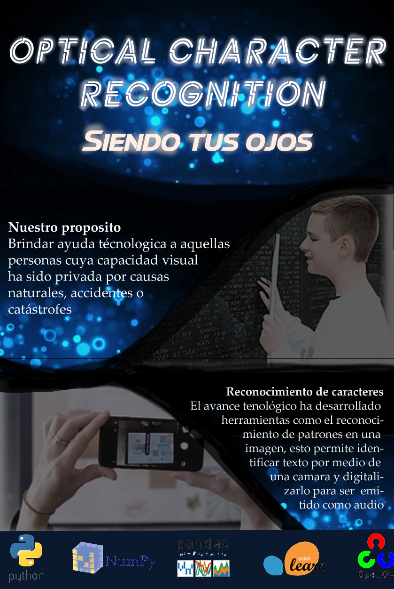

ESPAÑOL:
# Optical-Character-Recognition
Proyecto final para la asignatura Inteligencia Artificial

Bienvenido a nuestro proyecto.

Este proyecto fue propesto para la asignatura Inteligencia Artificial en mi carrera de Ingeniería
de Sistemas. El objetivo principla del mismo es, mediante una captura fotografica a un texto determinado,
mediante el uso de tecnicas de tratamiento de imágenes e inteligencia artificial poder determinar el texto
en la fotografia, para luego mediante una voz computarizada leer el mismo.

Video explicativo: https://youtu.be/8-zeLDFyRxY

ENGLISH:
# Optical-Character-Recognition
Final project for the Artificial Intelligence subject

Welcome to our project.

This project was intended for the Artificial Intelligence subject in my Engineering career
Systems. The main objective of it is, by means of a photographic capture of a certain text,
through the use of image processing techniques and artificial intelligence to be able to determine the text
in the photograph, and then read it by means of a computerized voice.

Explanatory video(in spanish): https://youtu.be/8-zeLDFyRxY
